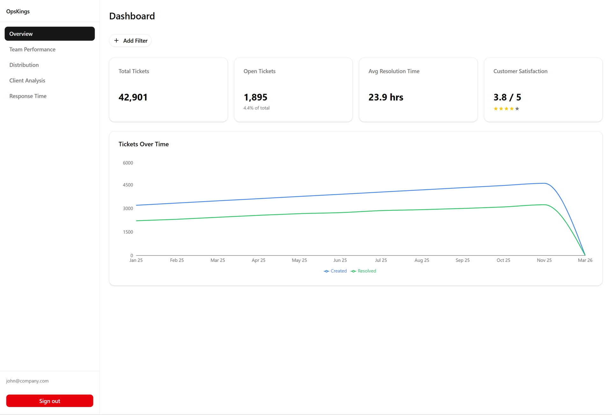
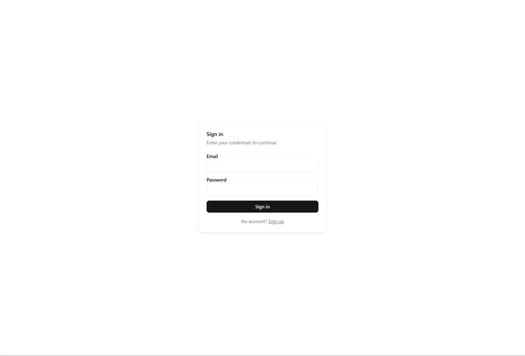
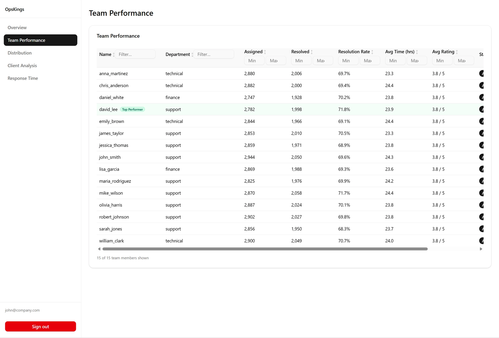
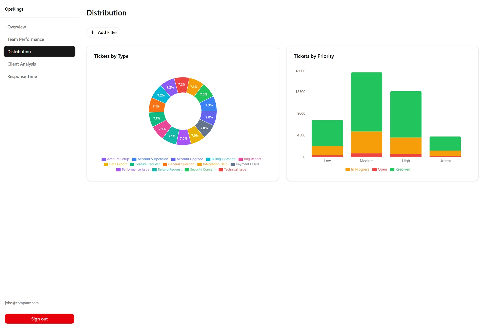
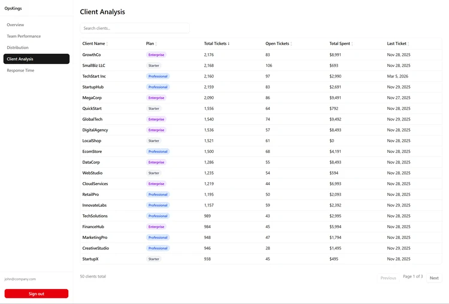
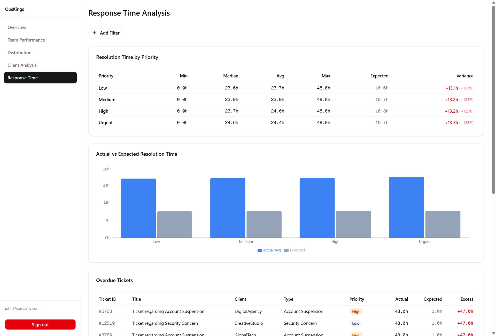
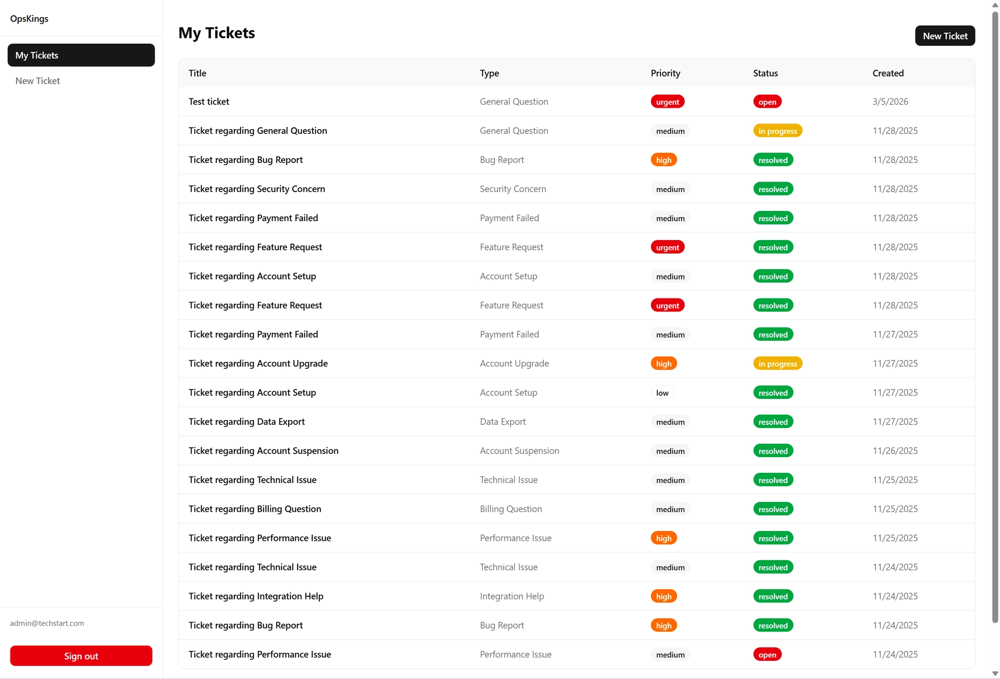
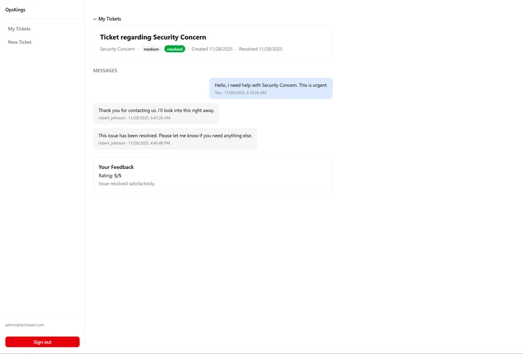

# OpsKings Support Analytics Dashboard

A full-stack support analytics dashboard built for the OpsKings development interview. Processes ~40,000 tickets across 50 clients and 15 team members with role-based access control, real-time filtering, and optimized query performance.

> **[Live Demo](<!-- REPLACE: your Vercel URL -->)** · **[Video Walkthrough](<!-- REPLACE: your Loom URL -->)**



---

## Table of Contents

- [Features](#features)
- [Tech Stack](#tech-stack)
- [Architecture](#architecture)
- [RLS Implementation](#rls-implementation)
- [Security Considerations](#security-considerations)
- [Database Optimization](#database-optimization)
- [Performance Results](#performance-results)
- [Scaling Strategy](#scaling-strategy)
- [Screenshots](#screenshots)
- [Setup & Running Locally](#setup--running-locally)
- [Environment Variables](#environment-variables)
- [Assumptions](#assumptions)
- [Future Improvements](#future-improvements)

---

## Features

**Team Member Dashboard**
- Summary cards (total tickets, open tickets, avg resolution time, customer satisfaction)
- Tickets over time chart (created vs resolved by month)
- Team performance table with sorting, filtering, and top performer highlighting
- Ticket distribution by type (donut chart) and priority (stacked bar chart)
- Client analysis with search, pagination, and column sorting
- Response time analysis with statistical breakdown and overdue ticket tracking

**Client Portal**
- View own tickets with status and priority
- Create new support tickets
- View ticket details and message history
- Submit feedback on resolved tickets

**Shared Infrastructure**
- Advanced filter system: date (exact/range/on-or-before/on-or-after), team member, ticket type, priority — each with is/isNot/isAnyOf/isNoneOf operators
- URL-synced filters (shareable filtered views)
- Role-based routing enforced at middleware + layout level
- Skeleton loading states on every data-fetching component

---

## Tech Stack

| Layer | Technology |
|-------|-----------|
| Framework | Next.js 16 (App Router, Server Actions) |
| Language | TypeScript (strict mode) |
| Database | Supabase PostgreSQL |
| ORM | Drizzle ORM |
| Auth | BetterAuth (email/password, cookie session cache) |
| Data Fetching | TanStack Query v5 |
| Charts | Recharts |
| UI Components | shadcn/ui + Tailwind CSS |
| Deployment | Vercel |

---

## Architecture

```
Browser
  │
  ├─ Middleware (/sign-in, /sign-up bypass)
  │   └─ Fetches session via /api/auth/get-session
  │      (avoids postgres.js in Edge Runtime)
  │
  ├─ Dashboard (team_member role)
  │   └─ Client Components → useQuery() → Server Actions
  │
  └─ Portal (client role)
      └─ Server Components + Client Forms → Server Actions

Server Actions
  │
  ├─ getUserContext() ← cached per render via React cache()
  │   └─ BetterAuth session (cookie cache, 7-day TTL)
  │
  ├─ withRLS(ctx, fn) ← transaction wrapper
  │   ├─ SET LOCAL ROLE rls_user
  │   ├─ set_config('app.user_id', ...)
  │   ├─ set_config('app.user_role', ...)
  │   ├─ set_config('app.client_id', ...)
  │   └─ set_config('app.team_member_id', ...)
  │
  └─ Stored Functions (RLS inside function body)
      └─ adminDb.execute() — single round-trip

PostgreSQL (Supabase)
  ├─ RLS policies on all 7 tables (database/rls-setup.sql)
  ├─ rls_user role (NOLOGIN, NOBYPASSRLS)
  ├─ 4 session-var helper functions (get_app_user_role, etc.)
  ├─ 6 stored functions with built-in RLS (database/rls-functions.sql)
  └─ 7 composite indexes
```

### Dual-Client Pattern

A single database connection (`adminDb`) serves both admin and RLS-enforced queries:

- **Direct queries** — Reference lookups (team members, ticket types) run on `adminDb` without RLS since they contain no sensitive data.
- **RLS-enforced queries** — User-facing data goes through `withRLS()`, which opens a transaction, issues `SET LOCAL ROLE rls_user` (scoped to the transaction — auto-resets on commit/rollback), sets 4 session variables via `set_config()`, then executes the query under RLS enforcement.
- **Stored functions** — Dashboard aggregates use PostgreSQL functions that encapsulate the `SET LOCAL ROLE` + `set_config` + query in a single database round-trip, called via `adminDb.execute()`.

This avoids maintaining two separate connection pools while guaranteeing RLS is always enforced for user data.

> **Driver note:** Drizzle ORM is configured with the `postgres.js` driver (`drizzle(postgresClient)`). Because Supabase's Transaction Pooler runs pgBouncer in transaction mode, all postgres.js clients use `prepare: false` to disable prepared statements (pgBouncer cannot track them across pooled connections).

### Data Fetching Optimization

Next.js serializes concurrent server action calls from the same page. To avoid sequential waterfalls, pages that need multiple datasets use a single combined server action with `Promise.all` for server-side parallelism:

```
getDashboardAll()    → Promise.all([summary, ticketsOverTime])
getDistributionAll() → Promise.all([byType, byPriority])
getResponseTimeAll() → Promise.all([stats, overdueTickets])
```

Each combined action triggers one HTTP round-trip from the client with both database queries running concurrently on the server.

---

## RLS Implementation

### How BetterAuth Bridges to PostgreSQL RLS

BetterAuth handles authentication at the application layer (session cookies with a 7-day cache to eliminate repeated DB lookups). When a server action needs to query user data, the flow is:

1. `getUserContext()` extracts the user's `role`, `clientId`, and `teamMemberId` from the BetterAuth session
2. `withRLS(ctx, fn)` opens a Drizzle transaction on the superuser connection
3. Inside the transaction: `SET LOCAL ROLE rls_user` downgrades privileges (transaction-scoped, auto-resets)
4. Four `set_config()` calls inject the user's identity as PostgreSQL session variables
5. RLS policies read these variables via helper functions (`get_app_user_role()`, `get_app_client_id()`, etc.)
6. The actual query runs under full RLS enforcement

**Why `SET LOCAL ROLE` instead of a separate connection?** A dedicated `rls_user` connection would bypass BetterAuth entirely and require managing a second connection pool. `SET LOCAL ROLE` within a transaction gives us RLS enforcement with zero additional infrastructure — the role automatically resets when the transaction ends.

**Anti-spoofing:** The `messages_insert` policy enforces attribution at the database level:

```sql
-- Team members must use their own ID (cannot impersonate another agent)
get_app_user_role() = 'team_member'
  AND from_team_member_id = NULLIF(get_app_team_member_id(), '')::INT

-- Clients cannot claim to be a team member
get_app_user_role() = 'client'
  AND from_team_member_id IS NULL
  AND ticket_id IN (SELECT id FROM tickets WHERE client_id = ...)
```

### Access Matrix

| Data | Team Members | Clients |
|------|-------------|---------|
| Tickets | All tickets | Own tickets only |
| Messages | All messages | Messages on own tickets only |
| Feedback | All feedback | Feedback on own tickets only |
| Clients | All clients | Own client record only |
| Payments | All payments | Own payments only |
| Team Members | All | All (public info) |
| Ticket Types | All | All |

### `withRLS()` Implementation

```typescript
// src/lib/db/rls-client.ts
export async function withRLS<T>(ctx: UserContext, fn: (tx) => Promise<T>): Promise<T> {
  return adminDb.transaction(async (tx) => {
    await tx.execute(sql`SET LOCAL ROLE rls_user`);
    await tx.execute(sql`
      SELECT
        set_config('app.user_id',       ${ctx.userId},                    true),
        set_config('app.user_role',     ${ctx.role},                      true),
        set_config('app.client_id',     ${String(ctx.clientId ?? '')},     true),
        set_config('app.team_member_id', ${String(ctx.teamMemberId ?? '')}, true)
    `);
    return fn(tx);
  });
}
```

### Security Considerations

| Threat | Mitigation |
|--------|-----------|
| **Horizontal data access** (client A reads client B's data) | RLS policies filter all 7 tables by `get_app_client_id()`. Enforced at the database level — application bugs cannot leak cross-client data. |
| **Identity spoofing** (client impersonates a team member) | `messages_insert` policy requires `from_team_member_id = get_app_team_member_id()` for team members and `IS NULL` for clients. `clientId`/`teamMemberId` are derived from the server-side session, never from user input. |
| **Privilege escalation** (client accesses dashboard) | Middleware redirects clients to `/portal`; dashboard layouts call `getUserContext()` and redirect non-team-members. Even if bypassed, RLS limits query results to the client's own data. |
| **SQL injection** | All queries use Drizzle's `sql` tagged template (parameterized) or Drizzle ORM query builder. No string concatenation in queries. Stored functions use `$1`-style parameters. |
| **Heavy filter abuse** | Composite indexes cover all filter combinations. Pagination is enforced server-side (`LIMIT`/`OFFSET`). No unbounded result sets. |

---

## Database Optimization

### Composite Indexes

Every index targets specific query patterns identified during development:

| Index | Columns | Query Pattern |
|-------|---------|---------------|
| `idx_tickets_type_created` | (ticket_type_id, created_at) | Ticket type distribution with date filtering |
| `idx_tickets_assigned_status` | (assigned_to, status) | Team member filtering + status aggregation |
| `idx_tickets_priority_status` | (priority, status) | Priority distribution (stacked by status) |
| `idx_tickets_client_created` | (client_id, created_at) | Client ticket history with date range |
| `idx_tickets_created_status` | (created_at, status) | Date-range filtering on dashboard summary |
| `idx_payments_client_status` | (client_id, status) | Client analysis payment aggregation |
| `idx_tickets_client_id` | (client_id) | Client analysis CTE pre-aggregation |

### Stored Functions

Six PostgreSQL functions encapsulate complex aggregations. All use the default `SECURITY INVOKER` mode — they run under the caller's role, which is `rls_user` after the `SET LOCAL ROLE` issued at the top of each function body. This means RLS policies are fully enforced inside the function; there is no `SECURITY DEFINER` escalation. Each function sets RLS context and executes in a single database round-trip:

| Function | Purpose |
|----------|---------|
| `get_dashboard_summary_rls` | Total/open tickets, avg resolution time, avg rating |
| `get_tickets_over_time_rls` | Monthly created vs resolved counts |
| `get_client_analysis_rls` | Client metrics with search, pagination, sorting |
| `get_ticket_detail_rls` | Ticket + messages + feedback as JSON |
| `get_resolution_time_stats_rls` | Min/max/avg/median resolution hours by priority |
| `get_overdue_tickets_rls` | Tickets exceeding expected resolution time |

### CTE Pre-Aggregation (Cross-Join Fix)

The `get_client_analysis_rls` function was initially producing 283,940 intermediate rows due to a cross-join between tickets and payments per client. Rewriting with CTE pre-aggregation reduced this to 50 rows per CTE, yielding a **2.6x speedup** (348 ms to 135 ms). Dynamic SQL (`EXECUTE FORMAT`) was also replaced with static SQL + `CASE`-based ORDER BY to enable plan caching.

### No Materialized Views

The current dataset (40k tickets) does not require materialized views — all queries meet performance targets with standard indexes and stored functions. The [Scaling Strategy](#scaling-strategy) section covers when materialized views would become necessary.

---

## Performance Results

Measured with a benchmark script (`scripts/benchmark.ts`), 3-run average. Timings include network round-trip to Supabase (observed ~100–150 ms from Europe to `eu-central-1`; results will vary by region).

### Server Action Performance

| Query | Unfiltered | Filtered | Target | Status |
|-------|-----------|----------|--------|--------|
| Dashboard summary | 156 ms | 107 ms | < 500 ms | Pass |
| Tickets over time | 137 ms | 105 ms | < 800 ms | Pass |
| Team performance | 384 ms | N/A | < 500 ms | Pass |
| Tickets by type | 343 ms | 360 ms | < 800 ms | Pass |
| Tickets by priority | 350 ms | 355 ms | < 800 ms | Pass |
| Client analysis (page 1) | 135 ms | 132 ms | < 300 ms | Pass |
| Resolution time stats | 205 ms | 104 ms | < 500 ms | Pass |
| Overdue tickets (page 1) | 227 ms | 104 ms | < 300 ms | Pass |

**All 8 queries pass their performance targets.**

### End-to-End Production Performance

Full round-trip times measured via Chrome DevTools Network tab on the deployed Vercel instance (Vercel region: auto, Supabase: `eu-central-1`). These include browser→Vercel + Vercel→Supabase latency.

| Page | Load Time | Notes |
|------|-----------|-------|
| Dashboard | ~357 ms | Combined summary + chart in one action |
| Team Performance | ~671 ms | Single query with LEFT JOIN chain |
| Distribution | ~637 ms | Combined type + priority in one action |
| Client Analysis | ~347 ms | Paginated with CTE optimization |
| Response Time | ~449 ms | Combined stats + overdue in one action |

| Interaction | Time |
|-------------|------|
| Apply filter | ~383 ms |
| Sort column (clients) | ~390 ms |
| Filter (response time) | ~453 ms |
| Filter (distribution) | ~664 ms |

### Optimization: Sequential-to-Parallel Fix

Three pages originally fired two sequential server action calls (Next.js serializes concurrent calls per page). Combining them with `Promise.all` saved one full round-trip per page. Server actions independently validate auth via `getUserContext()`, so middleware only handles page-level routing redirects — it does not intercept server action requests. FilterBar's two reference data calls were also merged into one.

---

## Scaling Strategy

### Current Architecture (40k tickets — production ready)

The current setup handles 40k tickets well within all performance targets. Key factors:

- 7 composite indexes eliminating sequential scans on the tickets table
- Stored functions reducing application-to-database round-trips
- CTE pre-aggregation preventing cross-join explosions
- TanStack Query caching (30s stale time) reducing redundant fetches
- Connection pooling via Supabase Transaction Pooler (pgBouncer)

### 100k-500k Tickets

- **Current indexes scale linearly** — B-tree indexes handle up to ~500k rows with minimal degradation
- **Add materialized views** for dashboard summary aggregates, refreshed on a schedule (e.g., every 5 minutes via `pg_cron`) or on-demand after bulk updates
- **Partial indexes** on `status = 'open'` for the dashboard's open ticket count (small subset of total rows)

### 500k-1M+ Tickets

- **Table partitioning** by `created_at` (monthly ranges) — queries with date filters only scan relevant partitions
- **Read replicas** for analytics queries, keeping the primary for writes
- **Background jobs** (e.g., `pg_cron` or application-level worker) for heavy aggregations, writing results to a summary table
- **Consider BRIN indexes** on `created_at` columns — more space-efficient than B-tree for time-series data at scale

### Application Layer

- TanStack Query's `staleTime` already prevents redundant database hits within a session
- BetterAuth's cookie cache eliminates session DB lookups for 7 days
- React `cache()` deduplicates `getUserContext()` within a single server render
- Server-side `Promise.all` ensures multi-dataset pages never waterfall

---

## Screenshots

<!-- REPLACE: Add your screenshots here after taking them -->

| View | Screenshot |
|------|-----------|
| Sign In |  |
| Dashboard Overview |  |
| Team Performance |  |
| Ticket Distribution |  |
| Client Analysis |  |
| Response Time Analysis |  |
| Client Portal |  |
| Ticket Detail + Feedback |  |

---

## Setup & Running Locally

### Prerequisites

- Node.js 18+
- A [Supabase](https://supabase.com) project (free tier works)

### 1. Clone and Install

```bash
git clone https://github.com/<!-- REPLACE: your-username -->/opskings-dashboard.git
cd opskings-dashboard
npm install
```

### 2. Set Up Supabase Database

In the Supabase SQL Editor, run these files **in order**:

```sql
-- 1. Create tables and seed data
-- Run contents of: database/schema.sql
-- Run contents of: database/seed.sql

-- 2. Create rls_user role, helper functions, enable RLS, and create policies
-- Run contents of: database/rls-setup.sql

-- 3. Deploy stored functions used by server actions
-- Run contents of: database/rls-functions.sql
```

All scripts are idempotent — safe to re-run.

### 3. Configure Environment

```bash
cp .env.example .env.local
```

Edit `.env.local` with your Supabase credentials (see [Environment Variables](#environment-variables)).

### 4. Seed Auth Users

```bash
npm run seed:auth
```

This creates 4 demo users (idempotent — safe to re-run):

| Email | Password | Role |
|-------|----------|------|
| john@company.com | password123 | Team Member |
| sarah@company.com | password123 | Team Member |
| admin@techstart.com | password123 | Client (TechStart) |
| contact@growthco.io | password123 | Client (GrowthCo) |

### 5. Start Development Server

```bash
npm run dev
```

Open [http://localhost:3000](http://localhost:3000) — you'll be redirected to `/sign-in`.

---

## Environment Variables

Create a `.env.local` file from the provided `.env.example` template:

| Variable | Description | How to Get It |
|----------|-------------|---------------|
| `DATABASE_URL` | Supabase Transaction Pooler connection string (port 6543) | Supabase → Settings → Database → Connection string → Transaction Pooler |
| `BETTER_AUTH_SECRET` | Random secret for session signing (32+ chars) | Run `openssl rand -hex 32` |
| `BETTER_AUTH_URL` | Application base URL | `http://localhost:3000` for dev, your Vercel URL for prod |

> **Important:** `DATABASE_URL` must use the **Transaction Pooler** endpoint (port 6543), not the direct connection (port 5432). The postgres.js driver is configured with `prepare: false` as required by pgBouncer's transaction mode.

---

## Assumptions

- **No real-time updates** — Dashboard data refreshes on navigation or filter change (TanStack Query with 30s stale time). WebSocket live updates were not implemented as the spec focuses on analytics views.
- **Single timezone** — All timestamps stored and displayed in UTC. No per-user timezone conversion.
- **Demo credentials** — The seed script creates users with simple passwords for evaluation purposes. A production deployment would enforce stronger password policies.
- **40k ticket dataset** — The provided seed data was used as-is. Performance was optimized and tested against this dataset, with a scaling strategy documented for 100k+ growth.
- **No email verification** — BetterAuth is configured for email/password without email verification flow, appropriate for an interview demo.
- **Client portal is read-heavy** — Clients can create tickets and leave feedback, but cannot update ticket status or reassign tickets. This matches the spec's scope.
- **Database-only Supabase** — The app uses Supabase purely as a PostgreSQL host. There are no dependencies on the Supabase client SDK, Supabase Auth, Realtime, or Storage. Auth is handled by BetterAuth, and the ORM layer is Drizzle with the `postgres.js` driver. Migrating to any PostgreSQL provider (Neon, Railway, AWS RDS, etc.) requires only changing `DATABASE_URL`.

---

## Future Improvements

- **WebSocket live updates** — Real-time ticket status changes and new message notifications via Supabase Realtime or a custom WebSocket server
- **Email notifications** — Trigger emails on ticket creation, status changes, and feedback received
- **Ticket assignment workflow** — Allow team leads to reassign tickets, with workload balancing suggestions
- **Granular permissions** — Role hierarchy (agent → team lead → admin) with configurable access scopes
- **Audit logging** — Track all data modifications with user attribution for compliance
- **Export functionality** — CSV/PDF export for dashboard views and client reports
- **Dark mode** — Theme toggle with system preference detection (shadcn/ui supports this natively)
- **Materialized views** — As ticket volume grows beyond 100k, pre-computed aggregates with scheduled refresh would maintain sub-500ms targets
- **E2E tests** — Playwright test suite covering auth flows, filter interactions, and portal operations

---

## Project Structure

```
src/
├── app/
│   ├── (auth)/              # Sign-in, sign-up pages
│   ├── dashboard/           # Team member analytics (5 pages)
│   ├── portal/              # Client portal (3 pages)
│   └── api/auth/            # BetterAuth API handler
├── components/
│   ├── charts/              # Recharts visualizations (4 components)
│   ├── dashboard/           # Dashboard-specific components
│   ├── filters/             # FilterBar + individual filter UIs
│   ├── layout/              # Sidebar (server) + SidebarNav (client)
│   ├── portal/              # Portal forms and buttons
│   └── ui/                  # shadcn/ui primitives (20+ components)
├── hooks/
│   └── use-filter-state.ts  # URL-synced filter state management
├── lib/
│   ├── auth/                # BetterAuth server + client + getUserContext
│   ├── db/                  # Drizzle schema, connections, withRLS
│   ├── queries/             # Server actions (dashboard, team, clients, portal)
│   └── actions/             # Reference data lookups
└── types/
    └── filters.ts           # Filter types + priority constants

database/
├── schema.sql               # Table definitions
├── seed.sql                 # 40k tickets, 50 clients, 15 team members
├── rls-setup.sql            # RLS role, helper functions, and policies
└── rls-functions.sql        # Stored functions (dashboard aggregates)

scripts/
├── seed-auth-users.ts       # Create demo BetterAuth users
└── benchmark.ts             # Performance benchmark suite
```

---

Built for the OpsKings Development Interview.
